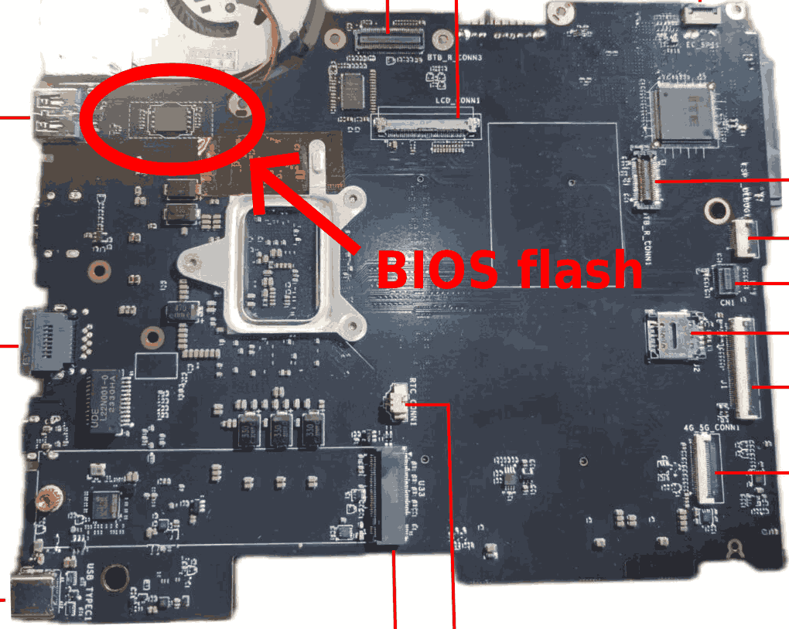

# Coreboot for the X210AI

A coreboot port for the X210AI: a Meteor Lake (Core Ultra 7 165H / 9 185H) mainboard for the ThinkPad X200/X201 chassis, with DDR5 SODIMM, two M.2 NVMe, a 2.5" SATA bay, and two USB C (one Thunderbolt 4).

## Building

```sh
git clone https://github.com/WheeledCord/coreboot-x210ai
cd coreboot-x210ai
git submodule update --init --checkout
make crossgcc-i386 CPUS=$(nproc)   # first time only; builds coreboot's toolchain
make menuconfig                    # Mainboard -> 51NB -> X210AI
make
```

Output is `build/coreboot.rom`. Only the BIOS region is built — the factory descriptor and ME stay on the chip.

## Disabling Boot Guard (do this first)

First verify Boot Guard can be disabled:

```sh
sudo setpci -s 00:16.0 0x40.l
```

If the output is `90000255`, it means the board is in manufacturing mode, and coreboot is possible. If you get something else, manufacturing mode mode is likely disabled and coreboot is not possible for your board (though I am yet to see a board where manufacturing mode is disabled)

The X210AI ships with Intel Boot Guard enabled, so the CPU won't run coreboot until it's disabled.

Because the board is in manufacturing mode, Boot Guard's config isn't fused and lives in editable SPI flash. You can disable it via Intel's MFIT, but this isn't accessible to most people (If you can find it, use it instead), so I provide an image [here](https://github.com/WheeledCord/coreboot-x210ai/releases). Back up your chip, then flash it internally:

```sh
flashrom -p internal -r factory_backup.bin
flashrom -p internal -w x210ai-bootguard-disabled.bin
```

## Making an image with MFIT

For many reasons, you may not want to flash the random binary I provided. If you have a version of MFIT that supports the MTL-P layout (I use version 18.0.10.2285), you can modify your own image to disable Boot Guard yourself.

Decompose your factory dump to get its config as editable XML:

```sh
wine mfit.exe --decompose dump.bin --saveconfig config.xml
```

In `config.xml`, find `BtGuardProfileConfig` and change its value from `Debug Profile` to `Boot Guard Disabled`, then rebuild:

```sh
wine mfit.exe --decompose dump.bin --loadconfig config.xml --build dump_bgdisabled.bin
```

## Flashing

MAKE SURE TO DISABLE INTEL BOOT GUARD FIRST!!!

Internal, from Linux on the running board (easiest):

```sh
flashrom -p internal --ifd -i bios -N -w build/coreboot.rom
```

Flashing externally with an SPI programmer can also be done. The SPI chip is a WSON-8 on the mainboard, circled here:



## Status

Boots Linux with NVMe/SATA, WiFi, Bluetooth, Ethernet, ALC1220 audio, internal eDP + external HDMI/DP, USB, and S3 resume all working. Only has been tested on my 165H version, with the 3000x2000 eDP display.

Untested: TPM (Intel PTT isn't enabled in this ME), Thunderbolt/USB4, WWAN.
